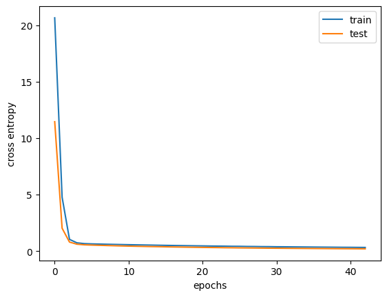
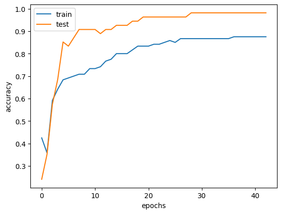
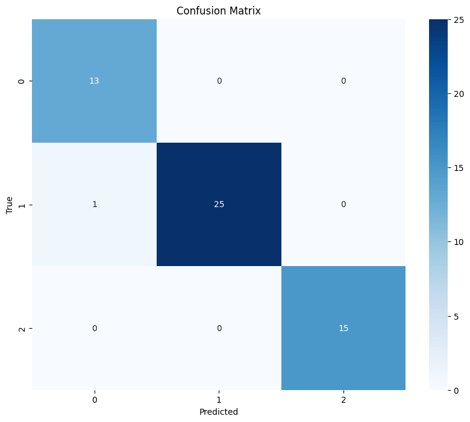

# Multi-class Classification PyTorch
 Project to examine the performance of neural networks in classification tasks using tabular data, with PyTorch. 

## Dataset description

The dataset can be accessed from <a href="https://archive.ics.uci.edu/dataset/109/wine ">https://archive.ics.uci.edu/dataset/109/wine </a> . 

The Wine dataset created by Stefan Aeberhard and M. Forina is a popular dataset for DS/ML studies.

| Variable Name| Role | Type |
|:-------------|:--------------:|--------------:|
| class      | Target         | Categorical       |
| Alcohol        | Feature       | Continuous         |
| Malicacid        | Feature       | Continuous         |
| Ash        | Feature       | Continuous         |
| Alcalinity_of_ash        | Feature       | Continuous         |
| Magnesium        | Feature       | Integer         |
| Total_phenols       | Feature       | Continuous         |
| Flavanoids       | Feature       | Continuous         |
| Nonflavanoid_phenols        | Feature       | Continuous         |
| Proanthocyanins        | Feature       | Continuous         |
| Color_intensity       | Feature       | Continuous         |
| Hue        | Feature       | Continuous         |
| 0D280_0D315_of_diluted_wines        | Feature       | Continuous         |
| Proline        | Feature       | Integer         |

## Usage

1. Install the ucimlrepo package
   
<pre>

pip install ucimlrepo

</pre>

2. Import the dataset into your code
<pre>

from ucimlrepo import fetch_ucirepo 
  
# fetch dataset 
wine = fetch_ucirepo(id=109) 
  
# data (as pandas dataframes) 
X = wine.data.features 
y = wine.data.targets 
  
# metadata 
print(wine.metadata) 
  
# variable information 
print(wine.variables) 

</pre>

3. Execute the code. Please feel free to modify the hyperparameters to see the performance of the model.
   
## Results

In our experiment we were able to obtain an accuracy of 98.1%. 

## Acknowledgement

Aeberhard,Stefan and Forina,M.. (1991). Wine. UCI Machine Learning Repository. https://doi.org/10.24432/C5PC7J.

Tam,Adrian.(2023).Building a Multiclass Classification Model in PyTorch. https://machinelearningmastery.com/building-a-multiclass-classification-model-in-pytorch/ 

